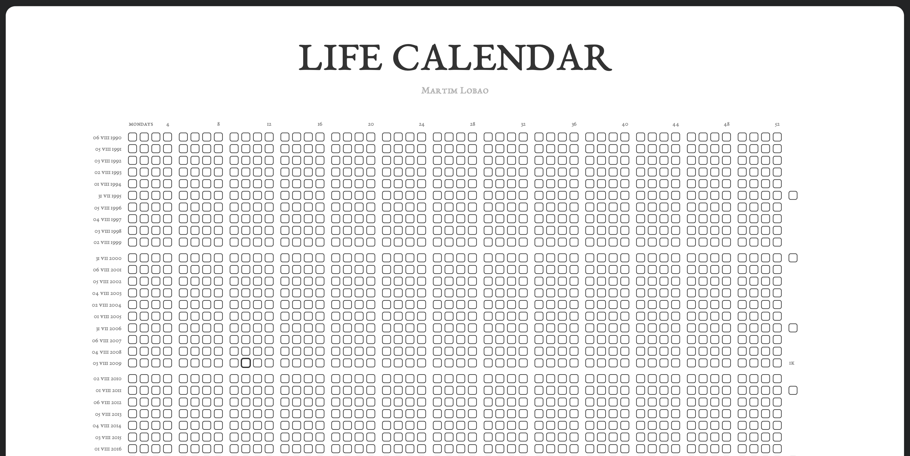

# Life Calendar



Life Calendar is a lightweight script that creates printable PDFs visualizing every week of a lifetime. Inspired by Tim Urban's ["Your Life in Weeks" post](https://waitbutwhy.com/2014/05/life-weeks.html), it helps you reflect on the past and plan for the future at a glance.

## Why this layout is different

Traditional life calendars, such as Tim Urban's grid or [4kweeks](https://4kweeks.com/), assume exactly 52 weeks per year. Because a year is actually a little longer than 52 weeks, those grids gradually drift: your birthday creeps one cell to the right every few years, and after enough decades it can spill into the next row. That makes the row number diverge from your age (admittedly, you'd need around 300 birthdays before it loops, but here's to optimistic longevity!).

This calendar keeps the first cell of every row aligned with the week of your birthday by inserting an extra week whenever it is needed. If you were born on a Monday, you fill each row starting on Mondays, and your birthday will always fall somewhere inside that first cell for its row. The dates shown on the left edge match the weekday of your birth on or before your birthday each year, keeping the birthday week anchored to the front of every row.

In addition to preserving the alignment with your birthday, the calendar highlights major milestones by thickening the borders around every thousandth week (1k, 2k, 3k, …) and every gigasecond (1Gs, 2Gs, …).

## PDF examples

* [Standard printable version](./static/life_calendar.pdf) — includes no pre-filled squares so you can mark them manually after printing.
* [Filled progress example](./static/life_calendar-darkened.pdf) — shows the calendar with weeks darkened up to a specific date.

## Usage

If you don't already have [`uv`](https://docs.astral.sh/uv/getting-started/installation/) installed, follow the official installation instructions first.

Run the script directly with `uv` by pointing to the raw GitHub URL:

```bash
uv run https://raw.githubusercontent.com/martimlobao/life-calendar/main/life_calendar.py 1990-08-06 -d -a 100 -b "Martim Lobao" -x 2010-05-15,2015-09-10,2020-12-31,2024-07-04
```

This command will generate a PDF highlighting the provided milestone dates for the named person and duration.

### Arguments

* `date` (positional): Starting date (typically your birthday) in `YYYY-MM-DD` or `DD/MM/YYYY` format.
* `-f/--filename`: Output filename (defaults to `life_calendar.pdf`).
* `-s/--a-size`: Paper size using ISO 216 A-series numbering (`A2` by default).
* `-t/--title`: Title text displayed at the top of the PDF.
* `-b/--subtitle-text`: Subtitle text shown beneath the title.
* `-a/--age`: Number of rows to generate, representing years of life (defaults to `100`).
* `-d/--darken-until`: Darken all weeks up to the supplied date (or up to today if no date is provided).
* `-x/--highlight-dates`: Comma-separated list of additional dates (`YYYY-MM-DD`) to highlight.

To produce a blank printable calendar, omit the darkening flag:

```bash
uv run https://raw.githubusercontent.com/martimlobao/life-calendar/main/life_calendar.py 1990-08-06 -a 100 -b "Martim Lobao"
```

## FAQ

**Why are there some rows with 53 cells?**  
Those rows contain the inserted extra week that keeps the first cell aligned with your birthday. The additional cell compensates for the fact that years are slightly longer than exactly 52 weeks.

**What are the dates on the left of the grid?**  
They mark the calendar date for the weekday you were born on, pegged to the occurrence on or before your birthday each year. For example, if you arrived on a Wednesday, each label shows the Wednesday that lands on or just before your birthday, kicking off that year's birthday week.

**What is the weekday at the top-left of the grid?**  
It shows the weekday you were born on. Fill in each new week on that weekday to stay synchronized with your birthday.

**What are the cells with thicker borders and the numbers/letters on the right side?**  
Thicker borders highlight milestone weeks (1k, 2k, 3k, …) and milestone gigaseconds (1Gs, 2Gs, …). The labels on the right correspond to those milestones.

